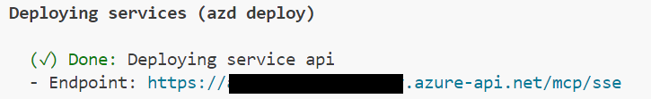

<!--
---
name: Remote Microsoft Graph MCP using Azure API Management (Experimental)
description: Use Azure API Management as the AI Gateway for MCP Servers, providing tools that calls Microsoft Graph API
page_type: sample
languages:
- dotnet
- bicep
- azdeveloper
products:
- azure-api-management
- microsoft-graph
- azure
urlFragment: remote-mcp-apim-msgraph
---
-->

# Secure Remote Microsoft Graph MCP Servers using Azure API Management (Experimental)


Azure API Management acts as the [AI Gateway](https://github.com/Azure-Samples/AI-Gateway) for MCP servers. 

This sample implements the latest [MCP Authorization specification](https://modelcontextprotocol.io/specification/2025-03-26/basic/authorization#2-10-third-party-authorization-flow). Then calls Microsoft Graph API in MCP tool.

This is a [sequence diagram](infra/app/apim-oauth/diagrams/diagrams.md) to understand the flow.

## Deploy Remote MCP Server to Azure

Run this [azd](https://aka.ms/azd) command to provision the api management service, web app(with code) and all other required Azure resources

    ```shell
    azd up
    ```

### MCP Inspector

1. In a **new terminal window**, install and run MCP Inspector

    ```shell
    npx @modelcontextprotocol/inspector
    ```

1. CTRL click to load the MCP Inspector web app from the URL displayed by the app (e.g. http://127.0.0.1:6274/#resources)
1. Set the transport type to `SSE`
1. Set the URL to your running API Management SSE endpoint displayed after `azd up` and **Connect** 
1. **List Tools**.  
1. Click the `ShowUserProfile` tool and **Run Tool**. The tool will return your user profile.


